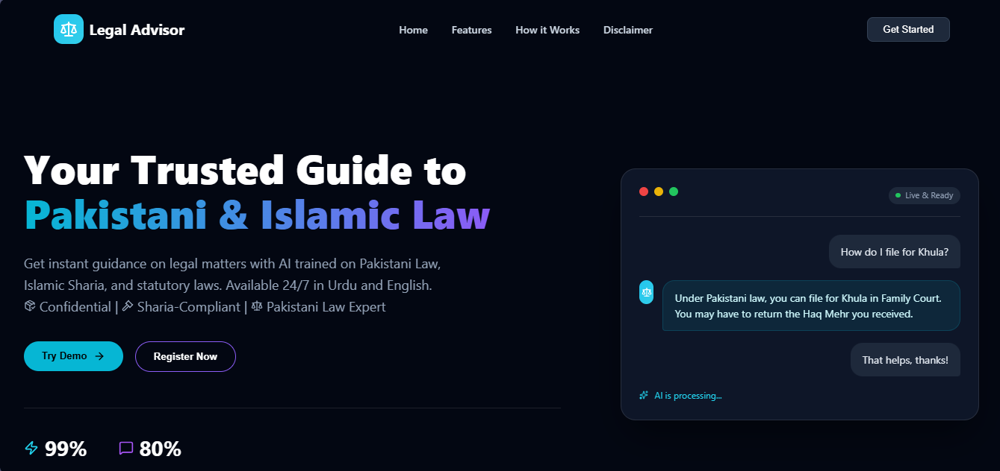
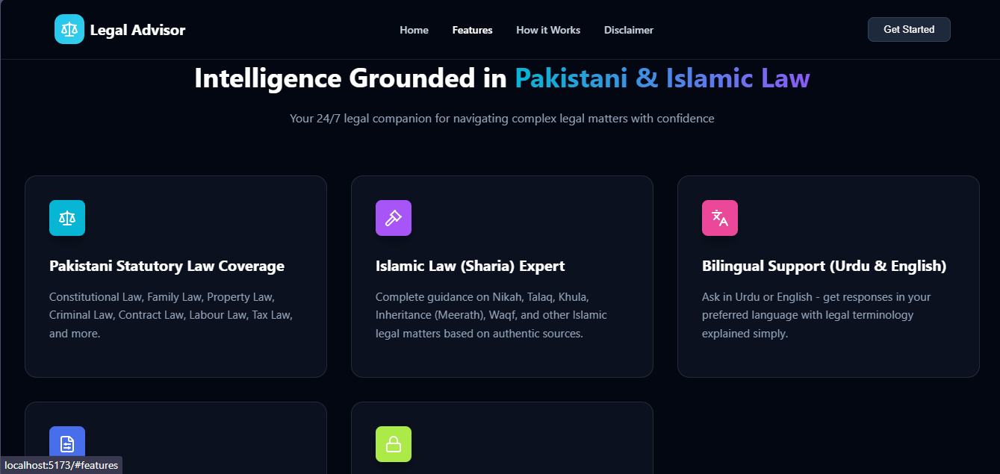
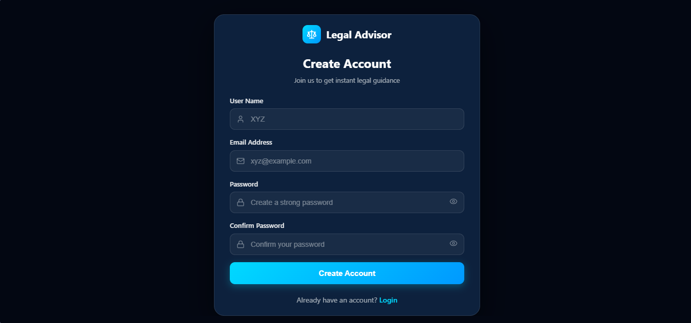
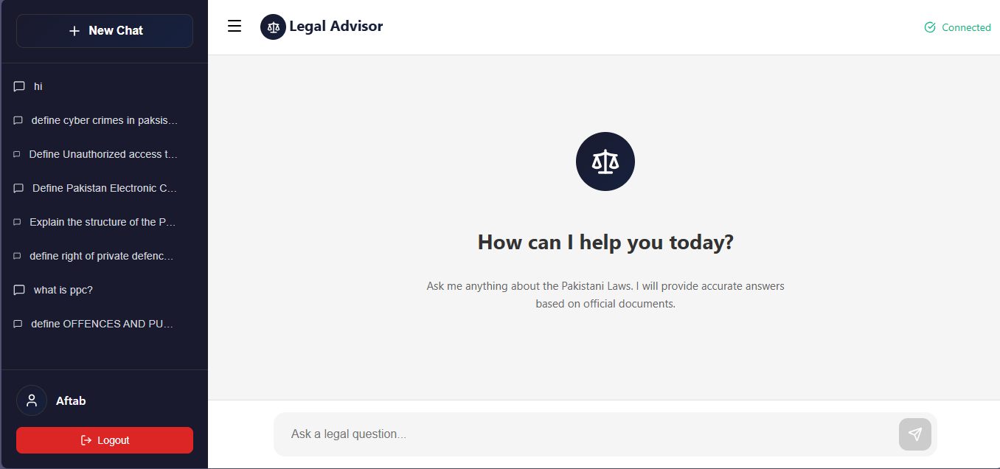
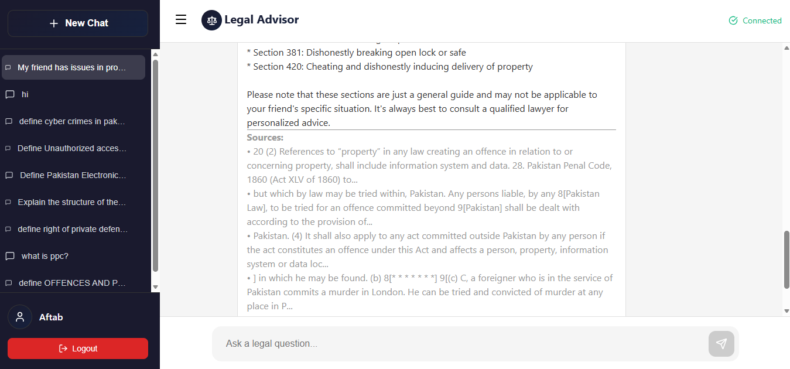

# Legal Advisor

Legal Advisor is a full-stack, AI-assisted legal information platform focused on Pakistani property law, Islamic property law, and property-case procedure. It combines a React interface with a Django REST API and a retrieval-augmented generation (RAG) pipeline that answers questions from indexed legal sources and returns supporting references.

> [!IMPORTANT]
> Legal Advisor provides source-based educational information. It is not a substitute for advice from a qualified Pakistani lawyer or Islamic scholar.

## Features

- Separate Pakistani, Islamic, and procedural legal views
- Source-grounded answers with citations and practical next steps
- Multi-agent question routing using LangGraph
- Semantic answer memory for repeated, materially equivalent questions
- Token-based signup, login, and authenticated chat
- Persistent chat sessions and message history
- User profiles, password reset, and application ratings
- Admin dashboard for user management and Markdown document ingestion
- Background ingestion with upload progress tracking
- Responsive React interface

## Screenshots

### Home page



### Features



### Sign up



### Chat



### Referenced answer



## Tech Stack

| Layer | Technology |
| --- | --- |
| Frontend | React 19, React Router, Vite, Lucide React |
| Backend | Python, Django 6, Django REST Framework |
| Authentication | Django token authentication |
| Application database | PostgreSQL |
| RAG orchestration | LangChain and LangGraph |
| LLM | Groq |
| Embeddings | Hugging Face `intfloat/multilingual-e5-large` |
| Vector database | Pinecone |
| Answer memory | SQLite and Pinecone |

## Project Structure

```text
LegalAdvisor/
├── backend/
│   ├── accounts/          # Authentication and profile endpoints
│   ├── backend/           # Django project configuration
│   ├── data/              # Legal Markdown sources and ingestion state
│   ├── legal_admin/       # Admin user-management API
│   ├── rag_api/           # RAG, chat history, ratings, and ingestion
│   ├── scripts/           # Legacy/import utilities
│   ├── manage.py
│   └── requirements.txt
├── frontend/
│   ├── src/
│   │   ├── components/    # Landing-page components
│   │   └── Pages/         # Application pages and API client
│   └── package.json
├── pics/                  # README screenshots
└── README.md
```

## Prerequisites

- Python 3.12 or newer
- Node.js 20.19+ (or 22.12+)
- PostgreSQL
- A Groq API key
- A Pinecone API key

The first backend run may download the multilingual E5 embedding model, which requires additional time and disk space.

## Local Setup

### 1. Clone the repository

```bash
git clone <repository-url>
cd LegalAdvisor
```

### 2. Create the PostgreSQL database

Create a PostgreSQL database and user for the application. The current Django database settings are in `backend/backend/settings.py`; update them for your local PostgreSQL instance before running migrations.

For production or shared development, move the database credentials and Django secret key to environment variables rather than committing them to source control.

### 3. Configure the backend

From the project root:

```bash
python -m venv legalenv
```

Activate the environment:

```bash
# Windows PowerShell
.\legalenv\Scripts\Activate.ps1

# macOS/Linux
source legalenv/bin/activate
```

Install dependencies:

```bash
python -m pip install --upgrade pip
pip install -r backend/requirements.txt
```

Create `backend/.env`:

```dotenv
GROQ_API_KEY=your_groq_api_key
PINECONE_API_KEY=your_pinecone_api_key

# Optional email configuration for password resets
EMAIL_HOST_USER=your_email_address
EMAIL_HOST_PASSWORD=your_email_app_password

# Optional overrides
GROQ_MODEL=llama-3.3-70b-versatile
EMBEDDING_MODEL=intfloat/multilingual-e5-large
EMBEDDING_DIMENSION=1024
EMBEDDING_DEVICE=cpu

PINECONE_PAKISTANI_INDEX=pakistani-property-law
PINECONE_ISLAMIC_INDEX=islamic-property-law
PINECONE_PROCEDURE_INDEX=property-case-procedure
PINECONE_PAKISTANI_NAMESPACE=documents
PINECONE_ISLAMIC_NAMESPACE=documents
PINECONE_PROCEDURE_NAMESPACE=documents
```

Apply migrations and optionally create an administrator:

```bash
cd backend
python manage.py migrate
python manage.py createsuperuser
```

### 4. Index the legal sources

Legal source files are stored as Markdown under:

- `backend/data/pakistani/`
- `backend/data/islamic/`
- `backend/data/Procedure/`

From `backend/`, ingest all datasets into Pinecone:

```bash
python -m rag_api.ingestion_service --dataset all
```

Useful ingestion options:

```bash
# Validate chunking without uploading vectors
python -m rag_api.ingestion_service --dataset all --dry-run

# Reprocess unchanged documents
python -m rag_api.ingestion_service --dataset all --force

# Process one collection
python -m rag_api.ingestion_service --dataset pakistani
```

The configured Pinecone indexes use cosine similarity and must match the embedding dimension (1024 by default). The ingestion command creates missing serverless indexes.

### 5. Start the backend

From `backend/`:

```bash
python manage.py runserver
```

The API will be available at `http://127.0.0.1:8000`.

Check its status at:

```text
http://127.0.0.1:8000/api/health/
```

### 6. Configure and start the frontend

In a second terminal:

```bash
cd frontend
npm install
```

The frontend uses `http://127.0.0.1:8000` by default. To use another backend, create `frontend/.env`:

```dotenv
VITE_API_BASE_URL=http://127.0.0.1:8000
```

Start Vite:

```bash
npm run dev
```

Open `http://localhost:5173`.

## Common Commands

### Frontend

```bash
cd frontend
npm run dev       # Start the development server
npm run build     # Create a production build
npm run lint      # Run ESLint
npm run preview   # Preview the production build
```

### Backend

```bash
cd backend
python manage.py runserver
python manage.py test
python manage.py makemigrations
python manage.py migrate
```

## API Overview

| Method | Endpoint | Purpose |
| --- | --- | --- |
| `POST` | `/accounts/signup/` | Create an account |
| `POST` | `/accounts/login/` | Log in and receive an auth token |
| `POST` | `/accounts/password-reset/` | Request a password-reset email |
| `PATCH` | `/accounts/password-reset-confirm/` | Set a new password |
| `POST` | `/api/query/` | Ask an authenticated legal question |
| `GET` | `/api/history/` | List the current user's chats |
| `GET` | `/api/history/<session_id>/` | Read a chat |
| `DELETE` | `/api/history/<session_id>/delete/` | Delete a chat |
| `GET` | `/api/health/` | Check API and RAG configuration |
| `POST` | `/api/rate-app/` | Submit a 1–5 rating |
| `POST` | `/api/upload-doc/` | Upload and index an authenticated Markdown file |
| `GET` | `/api/upload-status/<task_id>/` | Poll an ingestion task |
| `GET` | `/admin/users/` | List users as an administrator |

Authenticated requests use:

```http
Authorization: Token <token>
```

## How the RAG Pipeline Works

1. The master agent normalizes the question, considers recent chat context, and checks semantic answer memory.
2. It routes the request to the Pakistani, Islamic, or procedure retrieval agent selected by the user.
3. The selected agent retrieves and reranks relevant Pinecone passages.
4. The answer generator produces a direct answer, analysis, practical steps, missing information, and citations.
5. The response and chat history are stored for the authenticated user; eligible answers may also be reused through semantic memory.

## Adding Legal Sources

Add a `.md` or `.markdown` file to the appropriate directory under `backend/data/`, then run the ingestion command for that dataset. Markdown headings and optional front matter are preserved as retrieval metadata.

Administrators can also upload Markdown documents through the dashboard. Uploaded documents are indexed in a background thread, and the frontend polls the task-status endpoint until processing completes.

## Security Notes

- Do not commit `.env` files, API keys, email app passwords, database passwords, or Django secret keys.
- Replace development settings such as `DEBUG=True`, permissive hosts, and unrestricted CORS before deployment.
- Restrict authenticated profile-management endpoints and verify object ownership before exposing the service publicly.
- Use a persistent task queue and shared cache instead of background threads and local-memory status tracking in a multi-process production deployment.

## Disclaimer

The answers generated by this project are for education and general guidance only. Laws and interpretations can change, and individual facts materially affect legal outcomes. Always consult a qualified lawyer or scholar before acting on legal information.

## Team

- Aftab Ali
- Akbar Hussain
- Siraj Ahmed
